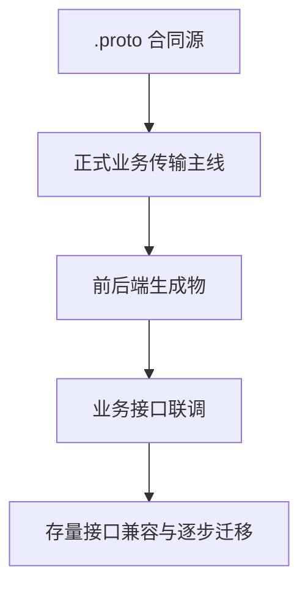

# Audit 001 Issue - Go 传输层单一真相与 ConnectRPC 主线迁移

## 1. 审计摘要
- 审计编号：`audit_001`
- 审计阶段：`phase06` 收口后、下一阶段正式 `/plan` 建立前
- 审计级别：`P1`
- 审计日期：`2026-08-10`
- 发起人：用户 + GPT54

## 2. 审计背景
- 功能背景：
  当前项目已在 `phase02 ~ phase06` 中完成 `.proto` 合同主线落地，并以 `chi + JSON HTTP` 作为过渡传输层完成前后端联调验收。
- 审计动机：
  在进入 `mvp0.3` 之前，需要明确当前 `chi + Protocol Buffers` 组合是否会不可避免地产生“两套真相”，以及后续应该采用怎样的最佳实践与迁移路径。
- 涉及模块：
  `backend/internal/platform/router.go`、`proto/`、`backend/internal/gen/proto/`、`frontend/src/gen/proto/`、所有业务模块 handler / transport adapter
- 涉及页面 / API / 读写链路：
  `Product / Module / Decision / Repository / Dashboard / Onboarding / Export / Backup / Reuse Summary`
- 关联角色：
  后端、前端、合同源、阶段规划
- 是否已有真实 bug：否
- 若已有，是否已转入 `fix`：不适用

## 3. 审计范围
- 本次纳入范围：
  - `.proto` 是否仍然是唯一长期合同源
  - `chi + JSON HTTP` 作为当前过渡传输层是否存在长期结构性隐患
  - `ConnectRPC` 是否应成为业务接口正式传输主线
  - `chi` 在未来架构中的保留职责
  - 存量业务接口的迁移策略与兼容层边界
- 本次明确不纳入范围：
  - 具体某一个业务模块的代码迁移实现
  - 某个单独接口的 bug 修复
  - `mvp0.3` 正式 phase 名称、spec 路径与 task 级拆分
- 是否涉及跨模块交互：是
- 若涉及，相关模块：
  `proto / backend / frontend / docs / build toolchain`

## 4. 当前现状回顾
- 当前 UI / API 现状：
  仓库已建立统一 `proto/` 合同源、`buf` 生成链与 `chi` 路由装配；现网业务接口仍以 `chi + JSON HTTP` 映射矩阵方式承接。
- 当前主要交互路径：
  浏览器访问前端 -> 前端调用 `/api/*` JSON 接口 -> `chi` handler -> service/repository
- 当前实现承接位：
  - 合同源：`proto/`
  - 路由装配：`backend/internal/platform/router.go`
  - 过渡映射说明：`proto/README.md`
  - 生成链：`proto/Makefile` + `buf.gen.yaml`
- 当前已知疑问点：
  1. `.proto` 已冻结为长期合同源，但现行业务传输仍是手工 JSON 映射，长期是否会漂移
  2. 若引入 `ConnectRPC`，应如何保留 `chi` 而不形成第二套路由/合同体系
  3. 存量接口是否应一次性迁移，还是按阶段逐步切换

## 5. 预设 workflow
- 从用户角度预期的最小闭环：
1. 团队明确 Go 业务接口的正式传输主线
2. 在独立前置 phase 中一次性完成 `phase01 ~ phase06` 已交付 canonical 业务接口向 `.proto + ConnectRPC` 的主线迁移
3. `chi + JSON HTTP` 旧业务接口只允许作为迁移过程中的临时技术手段，不允许作为 phase 收口后的长期稳态
4. `healthz / readyz / metrics / debug` 等非业务端点继续保留在 `chi + net/http`

## 6. 主要审计问题
- 问题一：
  当前“`.proto canonical + chi JSON 过渡传输`”是否仍然足够安全，还是已经接近不可控的双真相边界
- 问题二：
  在不推翻现有 `chi` 装配层的前提下，PSCO 的正式业务传输最佳实践应是什么
- 问题三：
  传输层收敛应作为局部优化处理，还是应上升为下一阶段 `/plan` 的结构性议题

## 7. 初步观察
- 当前实现并不是“完全两套真相”，因为：
  - `.proto` 已在根级规则中冻结为唯一长期合同源
  - `proto/README.md` 已明确 `chi + JSON HTTP` 只是过渡传输层
  - `buf build / lint / breaking / gen` 已形成统一工具链入口
- 但当前实现也不是长期最优，因为：
  - 业务传输仍依赖手工 JSON 映射矩阵与 handler DTO
  - `proto/README.md` 仍明确写着“后续迁移时再加回 grpc/connect 插件”
  - 随着 `mvp0.3` 引入 review loop、新写路径与新增业务接口，继续复制过渡模式会放大漂移成本
- 在已经决定新开前置 phase 的前提下，“让旧 JSON 业务接口长期以兼容层身份留存”也不再是最佳目标；对当前项目更合理的目标，是在该 phase 收口前完成业务主线一次性切换
- 本次审计需要回答的，不是“现在是不是完全错误”，而是“现在是否应当继续作为默认模式”

## 8. 关联冻结原则检查
- 是否涉及角色边界：是
- 是否涉及信息架构：是
- 是否涉及 `query` 只读边界：否
- 是否涉及主写路径边界：否
- 是否涉及 mutation 固定承接位：否
- 是否涉及 shared 膨胀或切片回退：否

## 9. 预期输出
- 是否需要判断“原样不动还是改进” ：是
- 是否需要最佳实践对标结论：是
- 是否需要明确后续去向：是
