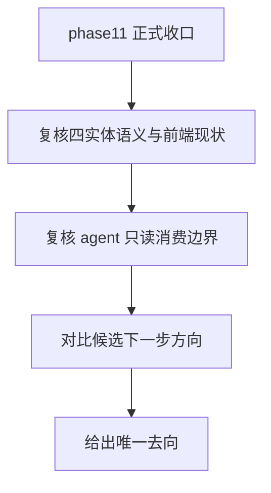

# Audit 002 Issue - phase11 收口后四实体语义对齐与 agent 渠道下一步方向仲裁

## 1. 审计摘要
- 审计编号：`audit_002`
- 审计阶段：`phase11` 正式收口后、下一阶段 `/plan` 建立前
- 审计级别：`P1`
- 审计日期：`2026-08-16`
- 发起人：用户 + ChatGPT

## 2. 审计背景
- 功能背景：
  `phase11_project_context_foundation` 已完成正式验收与收口，根级上下文真相源治理、最小只读项目上下文读取与 AGENTS 风格导出已经落地，`PSCO` 作为“上下文系统”而非“开发流程控制器”的口径也已冻结。
- 审计动机：
  在 `phase11` 中，`Product / Repository / Module / Decision` 的语义被重新界定，但前端实现主要仍承接 `phase02 ~ phase04` 的既有合同与页面分层。同时，`phase11` 只完成了 agent 渠道的轻量只读消费基础，并未进入更重的消费通道或受控维护能力。因此需要先回答：下一步应优先做“前端语义一致性收口”，还是“继续深化 agent 渠道能力”，以及是否需要先重新进入一轮广义专家讨论。
- 涉及模块：
  `frontend/src/features/product-registry`、`frontend/src/features/repository-binding`、`frontend/src/features/module-registry`、`frontend/src/features/decision-center`、`backend/internal/projectcontext`、根级真相源入口与 `phase11` 三件套
- 涉及页面 / API / 读写链路：
  `Product Detail / List`、`Repository Binding Detail / List`、`Module Detail / List`、`Decision Detail / List`、`ProjectContextService.GetProjectContext / ExportProjectContext`
- 关联角色：
  前端交互、Go backend canonical core、agent 只读消费、阶段规划
- 是否已有真实 bug：否
- 若已有，是否已转入 `fix`：不适用

## 3. 审计范围
- 本次纳入范围：
  - `phase11` 冻结的四实体语义是否已经要求前端立即重构，还是只要求后续逐步对齐
  - 当前前端页面、类型与文案是否已经出现与 `phase11` 语义冻结直接冲突的实现
  - `phase11` 收口后，agent 渠道下一步应该优先深化到什么程度
  - 是否需要再次进入一轮广义专家评审，还是应先进入受控的内部审计与下一阶段 `/plan`
- 本次明确不纳入范围：
  - 具体前端实现改动、页面重构或 proto 字段调整
  - 新阶段正式命名、spec 路径与 task 级拆分
  - MCP / CLI / agent 写回 / 前端对话入口的实现设计
- 是否涉及跨模块交互：是
- 若涉及，相关模块：
  `docs/phase/phase11_*`、`PSCO-mvp05-summarize-feedback.md`、`frontend/src/features/*`、`backend/internal/projectcontext/*`

## 4. 当前现状回顾
- 当前 UI / API 现状：
  前端已经围绕四实体形成稳定切片：`product-registry`、`repository-binding`、`module-registry`、`decision-center`。这些切片的数据类型继续以早期 `phase02 ~ phase04` 的 proto/spec 为主要来源；而 `phase11` 对四实体的新增内容主要体现在语义解释、agent 消费边界与项目上下文导出能力上。
- 当前主要交互路径：
  浏览器前端继续围绕四实体 CRUD / detail / review / onboarding 主线工作；agent 则通过 `GetProjectContext / ExportProjectContext` 做只读消费。
- 当前实现承接位：
  - 前端四实体类型：`frontend/src/features/*/types.ts`
  - 前端四实体详情页：`frontend/src/features/*/pages/*detail*.tsx`
  - agent 只读消费入口：`backend/internal/projectcontext/*`
  - 语义冻结基线：`docs/phase/phase11_project_context_foundation_shared_baseline.md`
- 当前已知疑问点：
  1. 四实体语义已澄清，但前端页面文案、空状态与解释性语言是否需要同步对齐
  2. `phase11` 完成的是最小只读消费，而不是完整 agent 渠道；下一步是否应直接推进更重能力
  3. `PSCO-mvp05-summarize-feedback.md` 已给出 `mvp0.5` 总方向，是否还需要先重新开启一轮大范围专家讨论

## 5. 预设 workflow
- 从用户角度预期的最小闭环：
1. 明确 `phase11` 的语义澄清是否要求前端立即结构重构，还是只要求后续实现与表达逐步看齐
2. 明确 `phase11` 之后下一阶段应该优先承接什么单一主交付
3. 明确是否需要再次进入专家讨论，还是可以直接进入新的 `/plan`

## 6. 主要审计问题
- 问题一：
  `phase11` 中对 `Product / Repository / Module / Decision` 的语义重新界定，是否已经要求当前前端源代码立即进行结构性重构，还是更适合进入一轮语义一致性收口
- 问题二：
  `phase11` 完成的 agent 能力是否只是“轻量只读基础”，如果是，那么下一步最合理的交付方向应是什么
- 问题三：
  面对下一阶段方向选择，当前是否需要先进入一轮新的专家共识讨论，还是应先依赖既有共识直接进入下一阶段 `/plan`

## 7. 初步观察
- `phase11` 对四实体的冻结口径是“语义澄清，不做结构重构”，这意味着后续实现需要看齐语义，但不自动等于立刻推翻既有前端模型
- 当前前端四实体切片没有出现明显违反 `phase11` 冻结语义的硬冲突；更大的问题是页面解释与认知表达仍主要停留在较早 phase 的业务视角
- `phase11` 的正式交付边界就是“根级治理 + 最小只读项目上下文导出 + AGENTS 风格导出 + dogfooding”，它不是完整 agent 平台 phase
- 当前真正需要判断的，不是“phase11 做得够不够多”，而是“`phase11` 之后的单一主交付该落在语义一致性、只读消费深化还是更重通道扩张”

## 8. 关联冻结原则检查
- 是否涉及角色边界：是
- 是否涉及信息架构：是
- 是否涉及 `query` 只读边界：否
- 是否涉及主写路径边界：否
- 是否涉及 mutation 固定承接位：否
- 是否涉及 shared 膨胀或切片回退：否

## 9. 预期输出
- 是否需要判断“原样不动还是改进”：是
- 是否需要最佳实践对标结论：是
- 是否需要明确后续去向：是
