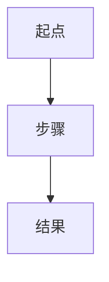
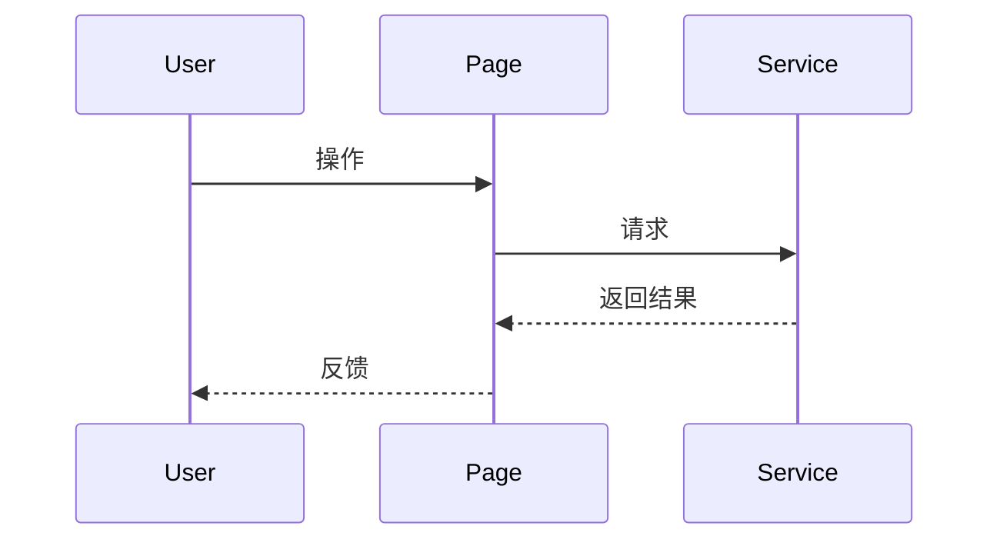

# Audit 001 Issue - 业主详情页信息表达与交互节奏系统回顾

## 1. 审计摘要
- 审计编号：`audit_001`
- 审计阶段：设计打磨 / 阶段性回顾
- 审计级别：`P1 / P2 / P3`
- 审计日期：
- 发起人：

## 2. 审计背景
- 功能背景：
- 审计动机：
- 涉及模块：
- 涉及页面 / API / 读写链路：
- 关联角色：
- 是否已有真实 bug：是 / 否
- 若已有，是否已转入 `fix`：是 / 否 / 不适用

## 3. 审计范围
- 本次纳入范围：
- 本次明确不纳入范围：
- 是否涉及跨模块交互：是 / 否
- 若涉及，相关模块：

## 4. 当前现状回顾
- 当前 UI 设计：
- 当前主要交互路径：
- 当前实现承接位：
- 当前已知疑问点：

## 5. 预设 workflow
- 从用户角度预期的最小闭环：
1.
2.
3.

- 如有必要，可补充 `mermaid` 功能流程图：

- 如有必要，可补充 `mermaid` 序列图：

## 6. 主要审计问题
- 问题一：
- 问题二：
- 问题三：

## 7. 初步观察
- 当前仅记录现象、疑问、怀疑点和希望验证的方向
- 不在本文件中直接给出实施方案
- 若怀疑点已触及既有冻结原则，应明确标注

## 8. 关联冻结原则检查
- 是否涉及角色边界：是 / 否
- 是否涉及信息架构：是 / 否
- 是否涉及 `query` 只读边界：是 / 否
- 是否涉及主写路径边界：是 / 否
- 是否涉及 mutation 固定承接位：是 / 否
- 是否涉及 shared 膨胀或切片回退：是 / 否

## 9. 预期输出
- 是否需要判断“原样不动还是改进” ：是 / 否
- 是否需要最佳实践对标结论：是 / 否
- 是否需要明确后续去向：是 / 否
